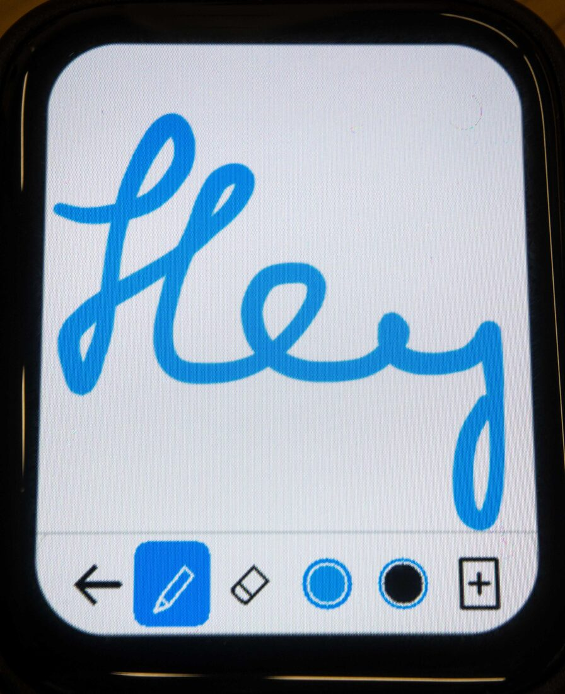
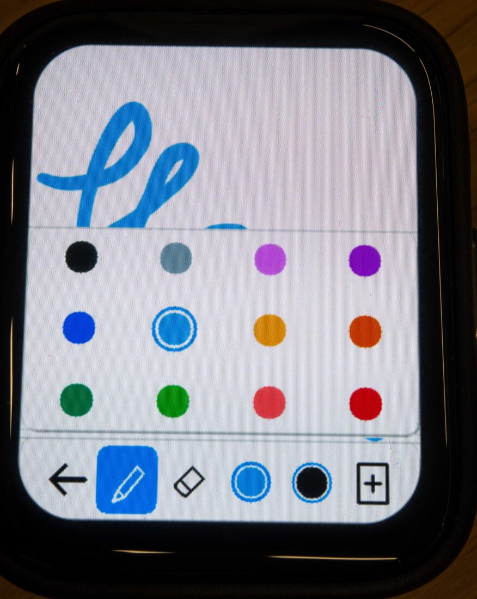
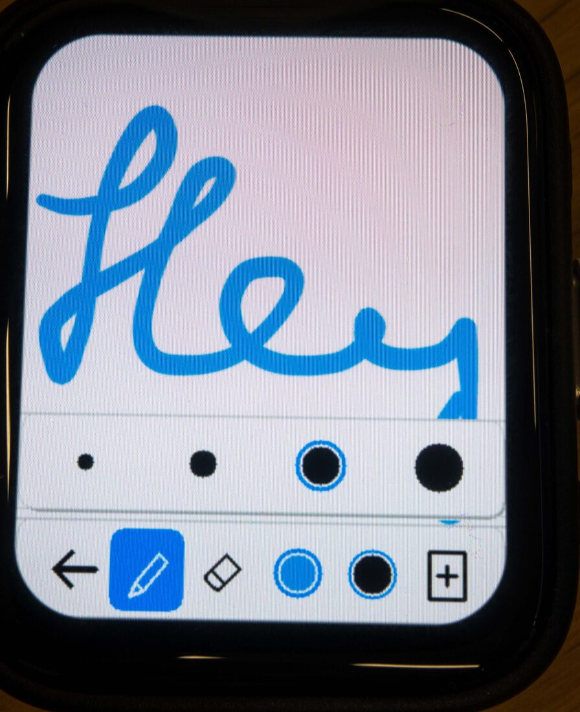

# TinyDraw

<p align="center">
  <a href="assets/readme/tinydraw-drawing.jpg"></a>
  <a href="assets/readme/tinydraw-colors.jpg"></a>
  <a href="assets/readme/tinydraw-sizes.jpg"></a>
</p>

TinyDraw is a small finger-drawing app for the 368×448 Waveshare ESP32-S3 Touch
AMOLED 1.8-inch V2 board. It runs on the CO5300 display with CST820 touch. A
macOS app and ESP-IDF/QEMU targets exercise the same C++20 drawing core.

## Current state

- Variable-width, Perfect Freehand-style ink with smooth sparse-input curves
- Solid self-overlaps, rounded sharp turns, and 4×4 edge smoothing
- Pen, eraser, pan, twelve tldraw colors, four sizes, confirmed New, and ten Undos
- A fixed 736×896 canvas, four times the screen area, with near-touch-rate panning
- Bounded 32×32 drawing updates and dirty-tile Undo in 8 MiB PSRAM
- Native replays, exact snapshots, ASan/UBSan, QEMU, and device telemetry

Recent long strokes average about 2.5–3.4 ms per update. Panning stays near the
75–77 Hz touch rate. The display now runs at a conservative 60 MHz after 80 MHz
produced occasional stray lines. Drawings are not yet persistent.

## Run the macOS app

```sh
./scripts/bootstrap-macos   # once
./scripts/dev run            # use run-2x or run-3x for a larger demo window
```

The window opens near the panel's physical size on a 14-inch 2021 MacBook Pro
at default scaling. Draw with the mouse, use `Cmd-Z` to undo, `C` for New, and
`Esc` to quit.

## Test and profile

```sh
./scripts/dev test          # native tests and end-to-end replays
./scripts/dev release       # optimized build and tests
./scripts/dev asan          # ASan and UBSan on the shared core
./scripts/dev perf          # sustained XL work and memory traffic
./scripts/dev format-check
```

## Build firmware

ESP-IDF v6.0.2 and QEMU stay isolated from the native toolchain:

```sh
./scripts/bootstrap-idf       # once
./scripts/esp32 build         # physical ESP32-S3 firmware
./scripts/esp32 qemu          # headless firmware replay
./scripts/esp32 graphics-test # automated virtual display check
./scripts/esp32 graphics      # visible QEMU framebuffer
```

Flash a connected board with:

```sh
cd esp32
eim run "idf.py -B ../out/build/esp32 -p PORT flash monitor"
```

QEMU verifies firmware integration and the 8 MiB memory model. Performance
measurements in [`FINDINGS.md`](FINDINGS.md) come from the host and physical
board. See [`DEVELOPING.md`](DEVELOPING.md) for the development loop.

## License

MIT
